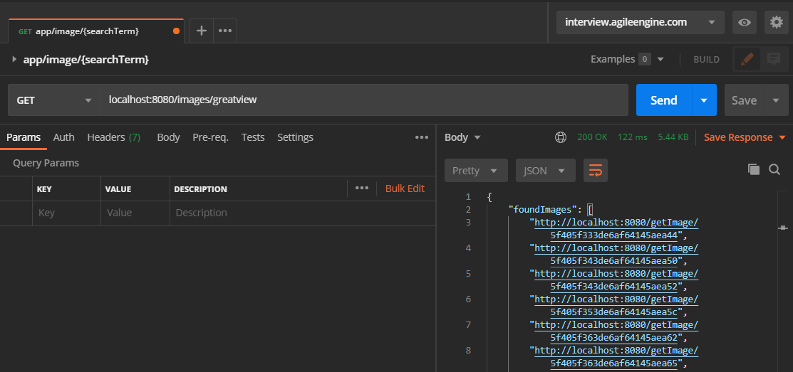
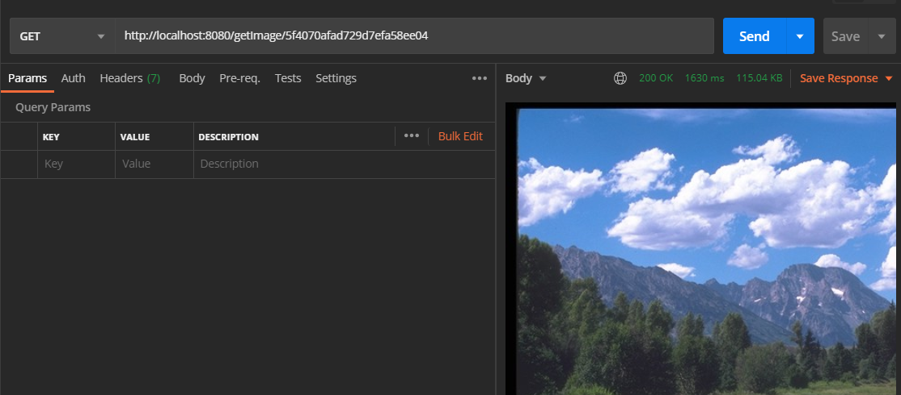

# Img Gallery App

### ToDo list:
* ~~AgileEngine Image API provider with auto auth~~
* ~~GridFS as image storage~~
* ~~Load images + metadata on startup~~
* ~~Scheduled reload of images + metadata~~
* ~~Search images by metadata~~
* ~~Dockerize app~~

### How to build and run App + MongoDB using Docker
* `cd ./img-gallery`
* `docker-compose up --build`

Now you can access img-gallery at `localhost:8080` and mongodb at `localhost:27018`.\
MongoDB data is persisted between containers restarts.

### Screenshots

